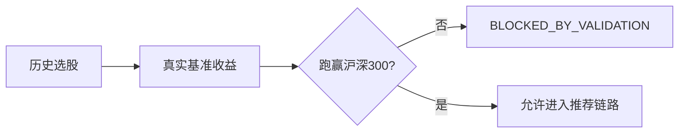
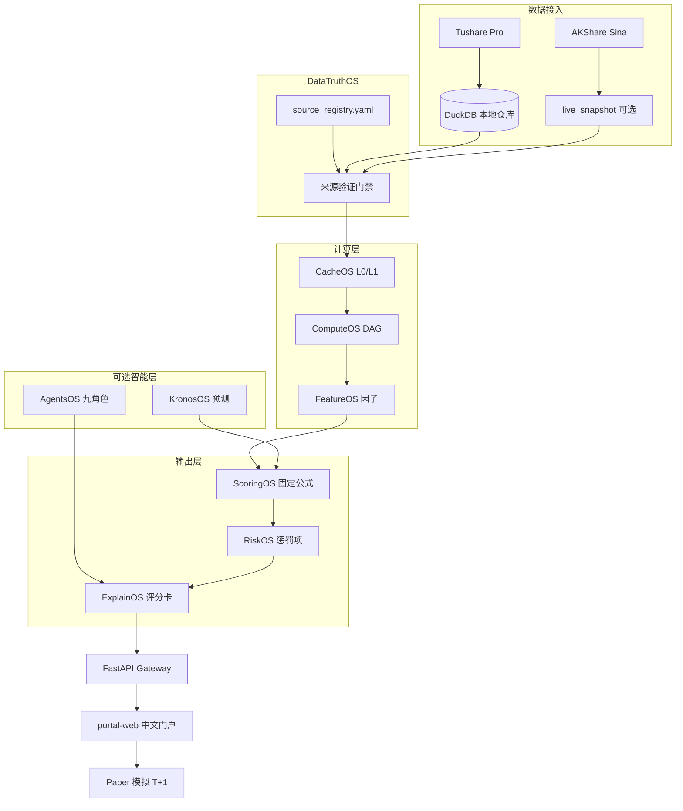
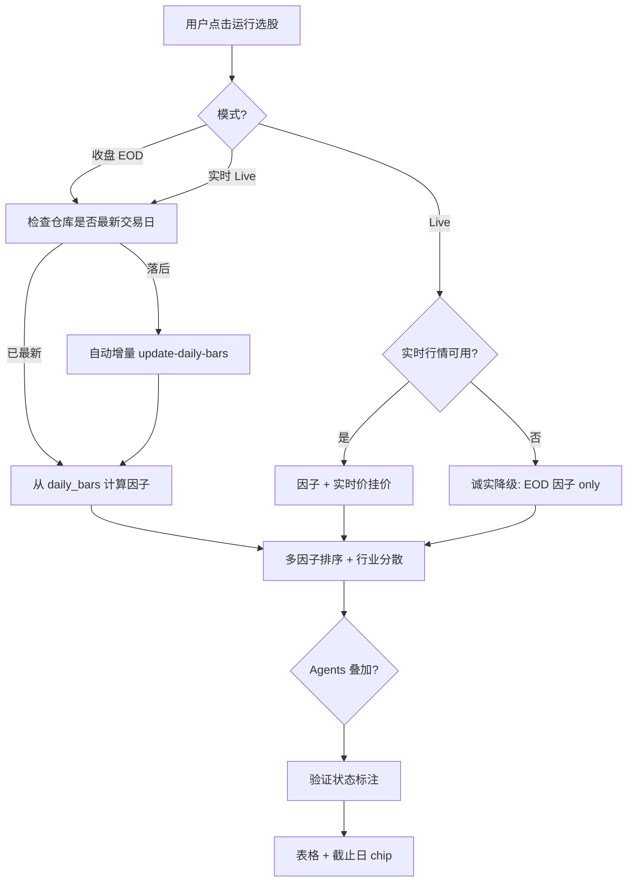
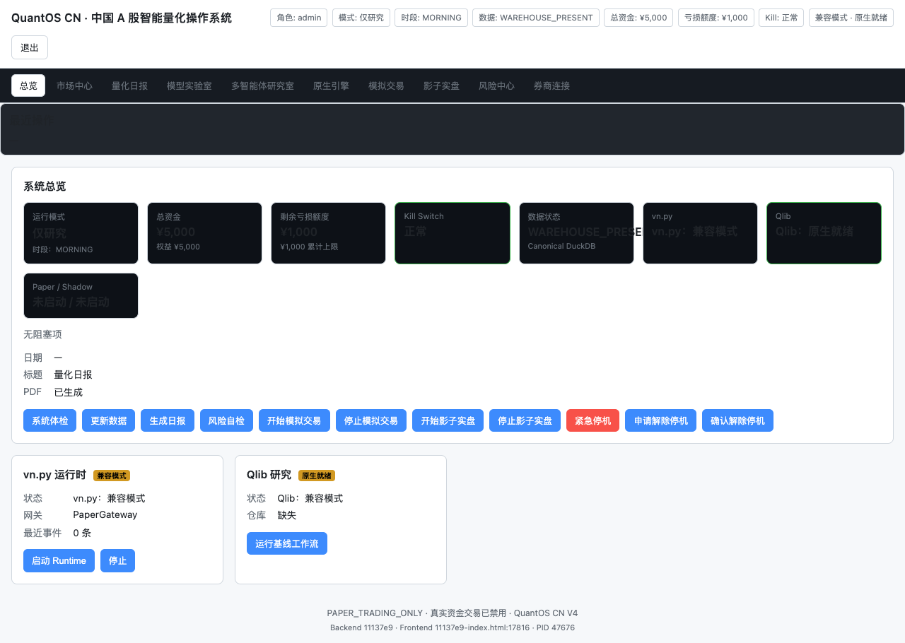

# QuantOS CN

> 如果这个项目对你有帮助，欢迎 **[⭐ Star 本项目](https://github.com/kenzhao0621-tech/quantos-cn)**，让更多人发现可审计的本地量化工具。

**中国 A 股本地量化工作台** — 可复现公式 · 数据可追溯 · Paper 模拟 · 开源 MIT

[](https://github.com/kenzhao0621-tech/quantos-cn/actions/workflows/ci.yml)
[](https://github.com/kenzhao0621-tech/quantos-cn/stargazers)
[](https://www.python.org/downloads/)
[](LICENSE)
[](#我们解决什么问题)
[](https://fastapi.tiangolo.com/)

**GitHub：** https://github.com/kenzhao0621-tech/quantos-cn

---

## 我们解决什么问题

你在 **东方财富、同花顺、腾讯 WorkBuddy、各类免费选股 App** 里能看到排名和「智能推荐」，但通常拿不到：

| 你关心的 | 常见免费平台 | QuantOS CN |
|---------|-------------|------------|
| 分数怎么算出来的 | 黑盒 / 文案解释 | **固定 YAML 权重 + 完整公式分解** |
| 数据来自哪里、是否最新 | 很少展示 | **DataTruthOS：每条数据带来源 URL、时间戳、质量等级** |
| 回测是否真实 | 容易「永远赚钱」 | **真实沪深300/等权基准；跑输则 `BLOCKED_BY_VALIDATION`** |
| 能否本地复现同一结果 | 云端闭源 | **本地 DuckDB + 同一输入同一分数** |
| 模拟交易规则 | 简化或缺失 | **T+1、涨跌停、100 股整数、手续费 Paper 引擎** |
| 模型预测是否可信 | 常与结论混为一谈 | **Kronos 单独标注 `degraded`；预测不保证发生** |
| 代码与隐私 | 账号绑定、行为上传 | **开源、本地运行、`data/` 与 `.env` 不上传 Git** |

> QuantOS CN **不是**另一个「免费荐股 App」。它是给愿意自己验证逻辑的研究者/进阶散户用的 **可审计量化工作台** — 不承诺收益，不自动真实下单。

---

## 核心优势（为什么不用免费平台就够）

### 1. 可复现，不是黑盒推荐

免费平台（东方财富智能选股、WorkBuddy 类助手等）擅长 **展示结论**；QuantOS 擅长 **展示推导过程**：

- 8 大因子固定权重（趋势 / 动量 / 量价 / 基本面 / 公告政策 / 板块 / Kronos / 情绪）
- 公式写死在代码与 `config/score_weights.yaml`，**LLM 不能改权重**
- 个股弹窗 **v2.3 评分卡**：每个因子得分、贡献、来源链接、数据截止时间

### 2. 数据诚实，缺失就降级

国内行情、公告、资金流在免费源上经常不完整。QuantOS 规则：

- 缺失因子 → 中性分 50 + **权重减半**，并在 UI 标「缺失·降权」
- 北向实时净买入等不可用源 → 注册表明确 `realtime_northbound_available: false`，**不伪造**
- 选股前 **自动检测仓库是否落后最新交易日**，尝试增量同步（需 `TUSHARE_TOKEN`）

### 3. 验证门：跑输基准就拦截



免费平台很少把「策略近期跑输指数」直接展示给用户；QuantOS 把它写进验证门。

### 4. 本地主权 + 开源

- 行情与因子在 **本机 DuckDB**，不依赖持续联网推理
- MIT 开源，可 fork、可改公式、可接自己的数据源（RQData / MiniQMT）
- Paper 模拟 **零真实资金**，实盘功能保留但 **默认关闭**

### 5. 多引擎叠加（可选、可关）

| 引擎 | 作用 | 与免费平台的差异 |
|------|------|------------------|
| **ScoringOS** | 确定性多因子分 | 非「AI 一句话荐股」 |
| **KronosOS** | K 线分布预测 | 单独面板；sidecar 不可用则统计降级 |
| **AgentsOS** | 九角色结构化研报 | JSON 输出；RiskManager 可 BLOCK |
| **ExplainOS** | 四面板解释卡 | 来源 URL 可点击核对 |

---

## 系统逻辑树（v2.3）

### 总管线



### 选股决策树



### 评分公式树

```text
FinalScore
├── BaseOpportunityScore（8 因子加权，缺失降权）
│   ├── trend 20%
│   ├── momentum 15%
│   ├── volume_money_flow 15%
│   ├── fundamental_quality 15%
│   ├── announcement_policy 10%
│   ├── sector_theme 10%
│   ├── kronos_forecast 10%  ← 可选，降级时置信度封顶
│   └── sentiment 5%
├── × RegimeMultiplier（牛/熊/震荡）
├── × DataQualityMultiplier（来源 tier S/A/B/C）
├── − RiskPenalty（ST、波动、集中度…）
├── − ExecutionPenalty（流动性、最小手数…）
└── − OverheatPenalty（短期过热）
```

---

## 界面预览

| 总览 | 数据同步 |
|:---:|:---:|
|  |  |

| 任务日报 | Paper 模拟 | 智能选股 |
|:---:|:---:|:---:|
|  |  |  |

---

## 与常见产品的定位对比

| 维度 | 东方财富 / 同花顺 | 腾讯 WorkBuddy 类 AI 助手 | QuantOS CN |
|------|------------------|---------------------------|------------|
| 部署 | 云端 App | 云端对话 | **本地 + 可选自托管** |
| 选股逻辑 |  proprietary | 大模型生成 | **固定公式 + 可导出分解** |
| 数据 provenance | 弱 | 弱 | **DataTruthOS 强约束** |
| 回测可信度 | 营销向 | 不适用 | **真实基准 + 拦截** |
| Paper / T+1 | 有但规则简化 | 无 | **规则引擎完整** |
| 定制因子/权重 | 不可 | 不可 | **改 YAML 即可** |
| 费用 | 免费 + 增值 | 免费额度 | **开源免费；数据源 Token 自付** |

**适合谁：** 愿意本地跑、看公式、做 Paper 验证的进阶用户。  
**不适合谁：** 只想打开 App 看一句「买这个」且不关心数据来源的用户。

---

## 快速开始

### 环境

| 项目 | 要求 |
|------|------|
| 系统 | macOS / Linux / Windows 10+ |
| Python | 3.9+（Kronos 可选 3.12 sidecar） |
| 内存 | 8 GB+ |
| 推荐 | [Tushare Pro](https://tushare.pro/) Token（收盘数据自动同步） |

### macOS / Linux

```bash
git clone https://github.com/kenzhao0621-tech/quantos-cn.git
cd quantos-cn
make bootstrap
cp .env.example .env    # 填入 TUSHARE_TOKEN
make app
```

浏览器打开：**http://127.0.0.1:8787/portal**

### Windows

```powershell
git clone https://github.com/kenzhao0621-tech/quantos-cn.git
cd quantos-cn
powershell -ExecutionPolicy Bypass -File scripts\bootstrap.ps1
copy .env.example .env
powershell -ExecutionPolicy Bypass -File scripts\start-app.ps1
```

详细安装 → [docs/INSTALL.md](docs/INSTALL.md)

---

## 三分钟上手

```
① 高级·数据 →「更新数据」（首次必做，写入本地 DuckDB）
② 智能选股 → 选「收盘数据（推荐·快速）」→ 运行选股
③ 看表格上方 chip：数据截止 YYYYMMDD、期望收盘日、是否已同步
④ 点击股票行 → v2.3 评分卡 + 智能体评语
⑤ 模拟练习 → Paper 组合（零真实资金）
```

**实时模式说明：** 交易时段可挂实时价；行情源被 WAF 拦截时会 **降级为收盘因子**，界面会明确提示，不会静默用旧数据冒充实时。

---

## 主要 API

| 端点 | 说明 |
|------|------|
| `GET /api/v1/screener/run` | 选股（`mode=eod` 推荐；自动检查仓库新鲜度） |
| `GET /api/v1/advisory/analyze` | v2.3 个股建议 + DataTruth 信封 |
| `POST /api/v1/market/live-refresh` | 手动刷新实时行情（交易时段） |
| `POST /api/v1/market/sync-all` | 一键 EOD 数据同步 |
| `GET /api/v1/gateway/capabilities` | 能力清单 |

文档：http://127.0.0.1:8787/docs

---

## 项目结构

```text
quantos-cn/
├── apps/portal-web/        # 中文门户（Vanilla JS，无构建）
├── gateway/                # FastAPI + AgentsOS
├── quant/
│   ├── cache_os/           # 缓存
│   ├── scoring_os/         # 固定评分公式
│   ├── explain_os/         # 解释卡
│   ├── data_truth_os/      # 数据来源验证
│   ├── models/kronos/      # Kronos 预测 sidecar
│   └── application/        # Screener / Advisory / 仓库新鲜度
├── config/                 # 权重、路由、来源注册表
├── tests/                  # pytest
└── docs/                   # 安装手册、集成审计、交付报告
```

---

## 文档索引

| 文档 | 内容 |
|------|------|
| [docs/INSTALL.md](docs/INSTALL.md) | 跨平台安装 |
| [docs/USER_GUIDE.md](docs/USER_GUIDE.md) | 页面流程 FAQ |
| [docs/integration_audit/](docs/integration_audit/) | v2.3 集成与 DataTruth 报告 |
| [docs/refactor_audit/](docs/refactor_audit/) | Kronos/Agents Phase 0–8 审计 |
| [CHANGELOG.md](CHANGELOG.md) | 版本历史 |

---

## 隐私与安全

- **不上传 Git：** `.env`、`.venv*`、`data/`（含 DuckDB 与行情缓存）
- **不存：** 交易密码、短信验证码
- **不构成投资建议**；实盘默认关闭（`PAPER_TRADING_ONLY`）
- 推送前运行：`bash scripts/validate-open-source.sh`

---

## English (brief)

**QuantOS CN** is a local-first, open-source China A-share quant workbench with reproducible scoring, DataTruth provenance, honest validation gates, and paper trading — designed for users who want to **audit the logic**, not just read a buy/sell tip from a free screener app.

```bash
git clone https://github.com/kenzhao0621-tech/quantos-cn.git && cd quantos-cn
make bootstrap && cp .env.example .env && make app
```

---

## License

[MIT License](LICENSE)

---

**投资有风险，决策需谨慎。QuantOS CN 为研究与模拟辅助工具，不构成投资建议。**
