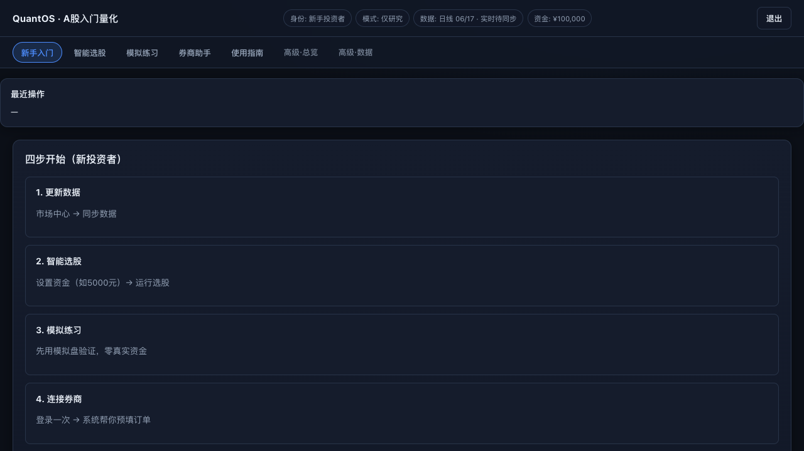
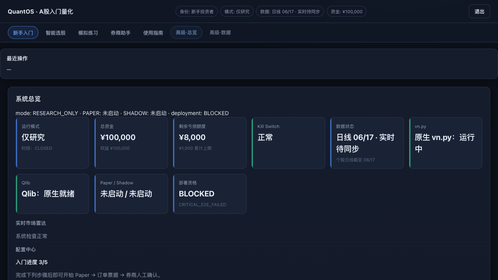
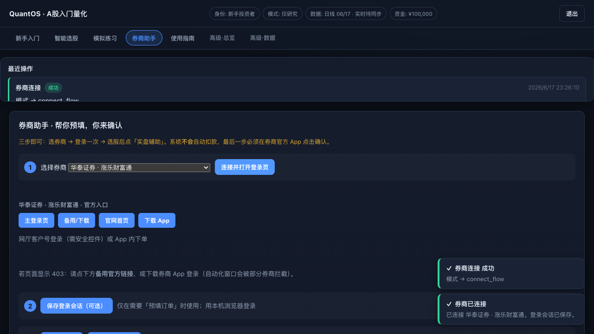

<div align="center">

# QuantOS CN

**中国 A 股智能量化操作系统 · 本地优先 · 模拟验证 · 人工确认辅助实盘**

[](https://www.python.org/downloads/)
[](LICENSE)
[](https://fastapi.tiangolo.com/)
[](#安全与合规)

[快速开始](#-快速开始) · [功能特性](#-功能特性) · [使用指南](docs/USER_GUIDE.md) · [产品介绍](docs/PRODUCT.md) · [架构说明](docs/ARCHITECTURE.md) · [对比分析](docs/COMPARISON.md)

</div>

---

> **QuantOS CN** 帮助 A 股个人投资者和量化研究者在**本机**完成：数据更新 → 多因子智能选股 → Paper 模拟验证 → 券商辅助填单。  
> 它不是云端黑盒投顾，**不承诺收益**，**不自动扣款下单**；真实交易须在券商官方 App 由你本人确认。

---

## 💡 为什么做这个项目？

| 痛点 | QuantOS CN 的做法 |
|------|-------------------|
| 云端量化平台逻辑不透明 | 本地 DuckDB + 可解释因子，策略逻辑在你机器上 |
| 研究工具只能回测、难接实盘 | Paper → Shadow → 订单票据 → 券商 handoff 闭环 |
| 小资金（如 ¥5,000）难做量化筛选 | 按资金算一手、股价区间过滤、增强版选股指南 |
| 全自动炒股风险高 | **人工确认** + 实盘门控 + Kill Switch，无人值守默认关闭 |
| 新手不知从何入手 | 中文 Web 门户 + 四步新手向导 + 完整用户指南 |

对标思路参考 [vn.py](https://github.com/vnpy/vnpy)（交易框架）、[Qlib](https://github.com/microsoft/qlib)（量化研究）的**文档清晰、可复现、社区友好**，但 QuantOS CN 专注 **A 股规则 + 门户化操作 + 安全辅助实盘**，而非替代上述底层引擎。

---

## ✨ 功能特性

| 模块 | 能力 | 说明 |
|------|------|------|
| **智能选股** | 多因子 + Alpha158-lite 融合 | 收盘/实时模式，名称、专业说明、收益区间、一手建议 |
| **增强版选股指南** | 最低价/最高价/资金上限 | 按预算自动限制可买标的，步骤化新手引导 |
| **Paper 模拟** | T+1、费用、仓位、Kill Switch | 零真实资金验证策略行为 |
| **Shadow 影子** | 零真实订单跟踪 | 晋级门控前的观察模式 |
| **券商助手** | 东方财富等浏览器 handoff | 预填订单；**不保存**交易密码 |
| **受控实盘** | Level 0–2 门控 | 可开启真实资金通道，须勾选风险确认；无人值守默认关 |
| **量化日报** | Markdown / PDF | 盘前/盘后自动化报告流水线 |
| **模型实验室** | Purged K-Fold、样本外验证 | 诚实标注 `NOT_READY` 时禁止盲目实盘 |
| **数据层** | DuckDB 仓库 | Tushare / AKShare，点-in-time 意识 |
| **研究智能体** | 多角色工作流 | 文献/政策/板块研究编排（可选） |

完整能力矩阵见 [docs/audit/FUNCTION_REALITY_MATRIX.md](docs/audit/FUNCTION_REALITY_MATRIX.md)（标注已实现 / 实验 / 规划中）。

---

## 🖼️ 界面预览

| 新手入门 | 智能选股 | 券商助手 |
|:--------:|:--------:|:--------:|
|  |  |  |

> 更多截图：`docs/ai/app/screenshots/` · 浏览器 E2E 报告：`docs/ai/app/07_BROWSER_E2E_REPORT.json`

---

## 🚀 快速开始

### 环境要求

- **macOS / Linux**（Windows 可用 WSL；QMT 路径为进阶可选）
- **Python 3.9+**
- **8 GB+ 内存**（推荐）
- 可选：`TUSHARE_TOKEN`（[Tushare Pro](https://tushare.pro/)，不填则部分功能走 AKShare 回退）

### 1. 克隆与安装

```bash
git clone https://github.com/kenzhao0621-tech/netlify-demo.git
cd netlify-demo
git checkout fix/a-share-quant-reliability-paper-validation   # 或 main / 最新 release 分支

make bootstrap
cp .env.example .env
# 编辑 .env，填入 TUSHARE_TOKEN（推荐）
```

### 2. 启动门户

```bash
make app
# 或前台调试：make portal
```

浏览器打开：**http://127.0.0.1:8787/portal**

### 3. 新手四步（推荐）

1. 身份选 **「新手投资者」** → 确认风险与法律条款  
2. **新手入门** → **更新数据**  
3. **智能选股** → 设资金（如 ¥5,000）→ 设股价区间 → **运行选股**  
4. **模拟练习** → 启动 Paper；满意后再到 **券商助手** 做辅助填单  

详细图文说明 → **[docs/USER_GUIDE.md](docs/USER_GUIDE.md)**

### 4. 常用命令

```bash
make doctor              # 环境与就绪检查
make daily-report        # 生成量化日报
make paper-start         # CLI 启动 Paper
make test-gateway        # 网关回归测试
make test-e2e            # API E2E

# 完整产品验收
.venv-china-quant/bin/python scripts/run_product_acceptance.py
.venv-china-quant/bin/python scripts/run_autonomous_remediation_acceptance.py
```

---

## 📚 文档导航

| 文档 | 适合谁 | 内容 |
|------|--------|------|
| [docs/USER_GUIDE.md](docs/USER_GUIDE.md) | **所有用户** | 安装、页面导航、四步流程、FAQ、免责 |
| [docs/PRODUCT.md](docs/PRODUCT.md) | 产品 / 投资人 | 定位、场景、版本、部署状态 |
| [docs/ARCHITECTURE.md](docs/ARCHITECTURE.md) | 开发者 | 模块划分、数据流、API 入口 |
| [docs/COMPARISON.md](docs/COMPARISON.md) | 选型者 | 与云端量化、vn.py、券商终端对比 |
| [CONTRIBUTING.md](CONTRIBUTING.md) | 贡献者 | 开发环境、PR 规范、测试 |
| [CHANGELOG.md](CHANGELOG.md) | 所有人 | 版本变更记录 |
| [docs/acceptance/FINAL_ACCEPTANCE_REPORT.md](docs/acceptance/FINAL_ACCEPTANCE_REPORT.md) | 运维 | 验收结论与阻塞项 |

API 交互式文档：启动后访问 **http://127.0.0.1:8787/docs**

---

## 🏗️ 技术栈

```
netlify-demo/
├── apps/portal-web/      # 中文 Web 门户（Vanilla JS）
├── gateway/              # FastAPI 网关：API、Paper、券商、风控
├── quant/                # A 股量化引擎：选股、评分、日报、验证
├── integrations/         # vn.py / Qlib 适配（可选原生 venv）
├── config/               # gateway.yaml、市场规则
├── scripts/              # 启动、E2E、日报流水线
├── tests/                # 单元与集成测试
└── docs/                 # 用户指南、验收、研究报告
```

| 层级 | 技术 |
|------|------|
| API | FastAPI · Uvicorn · Pydantic v2 |
| 数据 | DuckDB · pandas · Tushare · AKShare |
| 前端 | HTML / CSS / JavaScript |
| 测试 | unittest · pytest · Playwright |
| 包名 | `quantos-cn`（`pip install -e .`） |

---

## 🔒 安全与合规

- **不构成投资建议**；模型输出仅供参考  
- **不自动真实下单**；券商路径为浏览器 / CSV / QMT 文件投递，**须本人确认**  
- **不存储**交易密码、资金密码、短信验证码  
- **无人值守自动执行**默认关闭；验收与生产均不应开启  
- **A 股规则**：T+1、100 股整数倍、涨跌停与停牌拦截  
- 部署状态以系统标注为准（当前经济样本外多为 `NOT_READY`，见验收报告）

---

## 🗺️ 路线图

- [x] 多因子选股 + 名称/专业说明 + 股价区间  
- [x] Paper / Shadow 状态机 + T+1 模拟  
- [x] 券商浏览器 handoff + 实盘门控  
- [x] 增强版选股指南 + 自主验收脚本  
- [ ] 实时行情多源容错增强  
- [ ] 经济样本外验证达标（`PRODUCTION_READY_FOR_MANUAL_LIVE`）  
- [ ] 英文 README 与 Docker 一键镜像  

---

## 🤝 贡献

欢迎 Issue 与 PR。请先阅读 [CONTRIBUTING.md](CONTRIBUTING.md)。

```bash
git checkout -b feat/your-feature
make test-gateway
# 提交 PR，使用 conventional commits：feat: / fix: / docs:
```

**不接受**：无人值守自动真实下单、绕过券商确认、提交 `.env` 或 `data/` 运行时状态。

---

## 📦 发布到 GitHub 建议

若你 fork 或二次发布本仓库，建议：

1. **仓库 About** 填写描述：`China A-share quant platform — screener, paper trading, broker assist`  
2. **Topics** 添加：`quantitative-finance` `a-share` `fastapi` `duckdb` `paper-trading` `tushare`  
3. **Releases** 打 tag（如 `v4.1.0`）并附 `CHANGELOG` 摘要  
4. **不要上传**：`.env`、`data/`、`.venv-*`（已在 `.gitignore`）  
5. 将本 README 与 `docs/USER_GUIDE.md` 设为仓库首页文档  

---

## 📄 许可证

本项目采用 [MIT License](LICENSE) 开源。

---

<div align="center">

**投资有风险，决策需谨慎。QuantOS CN 为研究与模拟辅助工具，不构成投资建议。**

Made with ❤️ for A-share quant researchers

</div>
