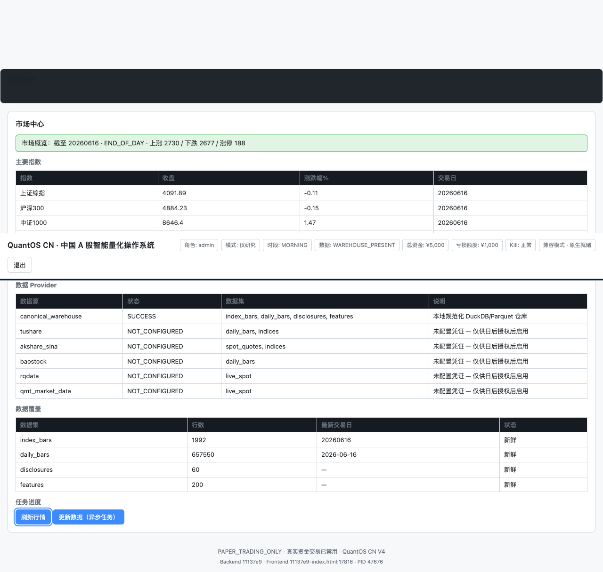
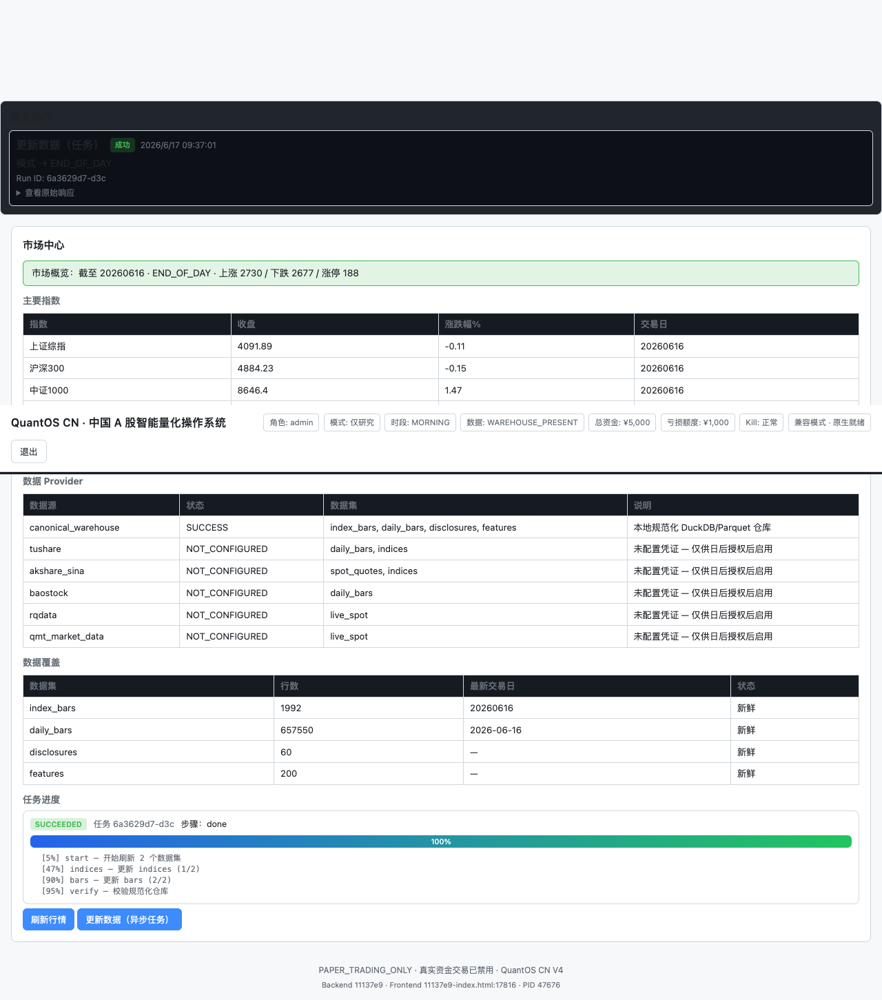
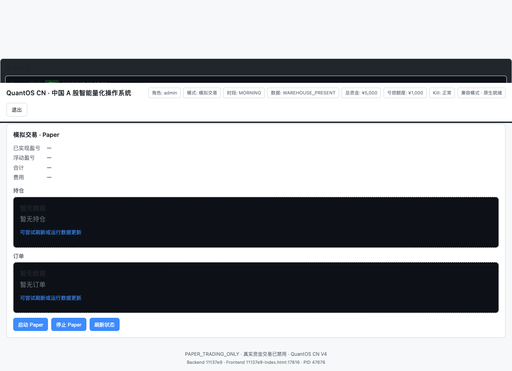
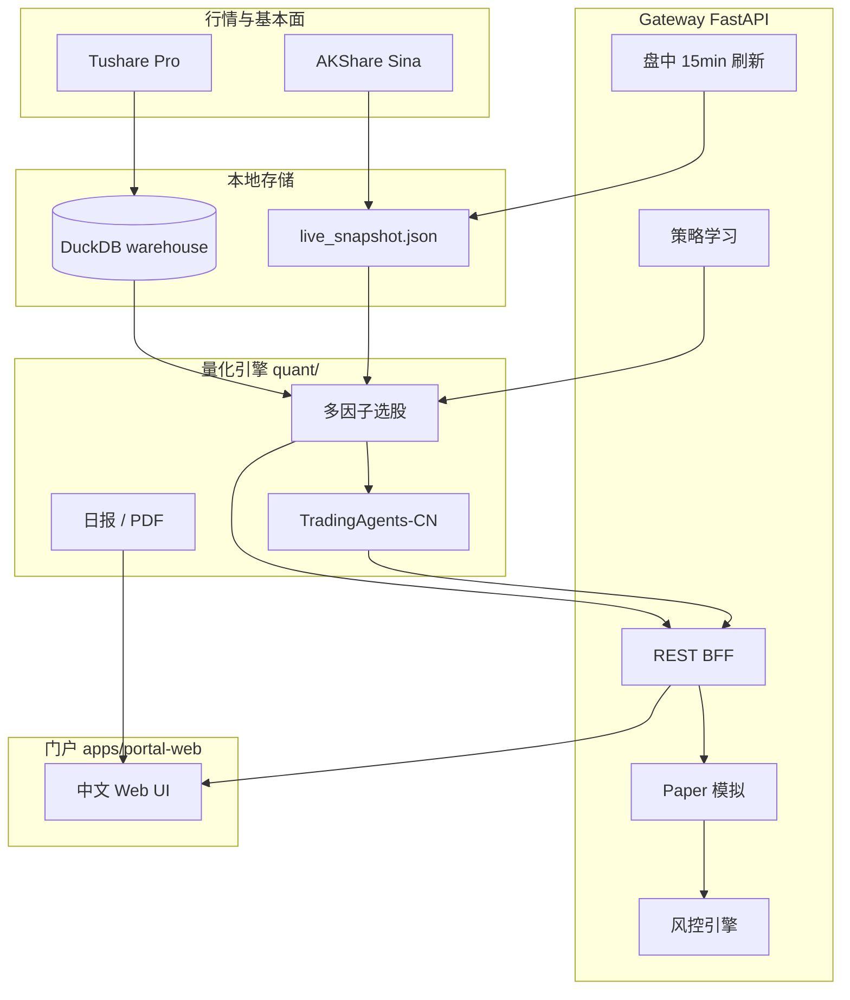

<div align="center">

# QuantOS CN

### 中国 A 股智能量化选股与模拟交易平台

**本地优先 · 多因子引擎 · 实时行情 · Paper 验证 · TradingAgents 叠加 · 人工确认辅助实盘**

[](https://www.python.org/downloads/)
[](LICENSE)
[](https://fastapi.tiangolo.com/)
[](#-技术特点)
[](#-快速开始)
[](#windows-安装)

[快速开始](#-快速开始) · [安装指南](docs/INSTALL.md) · [用户手册](docs/USER_GUIDE.md) · [项目结构](docs/PROJECT_STRUCTURE.md) · [开源清单](docs/OPEN_SOURCE_MANIFEST.md)

</div>

---

## 这是什么？

**QuantOS CN** 是一套面向中国 A 股的 **本地量化工作台** — 在你的电脑上运行，数据与模拟状态保存在本地，不依赖云端黑盒。

| 能力 | 说明 |
|------|------|
| **智能选股** | 多因子 + Alpha158-lite + TradingAgents-CN 多空评审；收盘快速 / 实时一键选股 |
| **实时行情** | 盘中每 15 分钟后台刷新；选股内置行情刷新，无需先切页面 |
| **Paper 模拟** | T+1、费用、涨跌停规则；真实行情盯盘与买卖信号 |
| **策略验证** | T+1 回测昨日选股 + 智能体参数调整建议 |
| **PDF 报告** | 量化日报、个股选股分析 PDF |
| **券商辅助** | 浏览器 handoff 预填订单（**不自动扣款**） |

> **不是** 投顾产品，**不承诺收益**，**不自动真实下单**。真实交易须在券商 App 由你本人确认。

---

## 界面预览

### 总览与系统状态


### 高级·数据（行情同步与就绪检测）



### 任务与日报



### 模拟练习（Paper）



### 智能选股


更多截图：`docs/ai/v6/screenshots/` · E2E 验收：`docs/ai/v6/`

---

## 技术特点

QuantOS CN 将 **研究、选股、模拟、风控** 放在同一本地闭环，区别于纯云端选股 App 或重型机构终端：

| 特点 | 技术实现 |
|------|----------|
| **本地数据主权** | DuckDB 仓库存储 EOD/因子；`data/` 不入 Git，克隆后自行拉取 |
| **双源行情路由** | Tushare Pro + AKShare Sina；休市智能降级，避免重复全市场拉取 |
| **会话感知实时刷新** | `live_market_service` 按交易时段选择 `require_live`；盘中 15min 后台线程 |
| **多因子 + 智能体叠加** | `screener_service` + TradingAgents-CN `cn_research` 工作流 |
| **策略学习闭环** | `screener_learning` T+1 验证 → `POST /api/v1/screener/learn` 调参建议 |
| **A 股规则引擎** | T+1、100 股整数倍、涨跌停拦截、行业分散约束 |
| **Gateway 2.1 能力面** | 统一 REST + RBAC + 审计 JSONL + `GET /api/v1/gateway/capabilities` |
| **零构建前端** | Vanilla HTML/CSS/JS，改完刷新即生效 |
| **跨平台** | macOS/Linux `Makefile` + Windows `bootstrap.ps1` / `start-app.ps1` |
| **可审计开源** | [OPEN_SOURCE_MANIFEST.md](docs/OPEN_SOURCE_MANIFEST.md) 列明不含本地密钥与账本 |

### 架构一览



### 技术栈

| 层级 | 技术 |
|------|------|
| API | FastAPI · Uvicorn · Pydantic v2 |
| 数据 | DuckDB · pandas · Tushare · AKShare |
| 前端 | HTML / CSS / JavaScript（无构建） |
| 智能体 | TradingAgents-CN 桥接 |
| 可选原生 | vn.py / Qlib 适配层 |
| 测试 | pytest · Playwright E2E |
| Python 包 | `pip install -e .` → `quantos-cn` v4.2 |

---

## 快速开始

### 环境要求

| 项目 | 要求 |
|------|------|
| 系统 | **macOS** / **Linux** / **Windows 10+** |
| Python | 3.9+（推荐 3.11） |
| 内存 | 8 GB+ |
| 可选 | [Tushare Pro](https://tushare.pro/) Token |

### macOS / Linux

```bash
git clone https://github.com/kenzhao0621-tech/quantos-cn.git
cd quantos-cn

make bootstrap
cp .env.example .env    # 填入 TUSHARE_TOKEN（推荐）
make app
```

浏览器：**http://127.0.0.1:8787/portal**

### Windows 安装

```powershell
git clone https://github.com/kenzhao0621-tech/quantos-cn.git
cd quantos-cn

powershell -ExecutionPolicy Bypass -File scripts\bootstrap.ps1
copy .env.example .env
powershell -ExecutionPolicy Bypass -File scripts\start-app.ps1
```

完整分步说明、FAQ、路径说明 → **[docs/INSTALL.md](docs/INSTALL.md)**

---

## 三分钟上手

门户默认 **管理员权限**，无需选择角色。推荐流程：

```
① 进入平台 → 确认风险提示
② 智能选股 → 资金 ¥5,000 →「收盘数据（快速）」→ 运行选股
③ 点击任意股票行 → 查看得分与理由（弹窗详情 + PDF 导出）
④ 模拟练习 → 启动 Paper → 加入模拟组合 → 观察自动盯盘
⑤ 策略验证 → 验证昨日选股 / 策略自验证学习
```

| 标签页 | 功能 |
|--------|------|
| **智能选股** | 收盘/实时选股、一键实时智能、行点击查看详情、加入 Paper |
| **策略验证** | T+1 昨日验证、自验证学习循环、参数建议 |
| **模拟练习** | Paper 持仓、15 分钟自动行情、买卖信号 |
| **券商助手** | 只读连接、订单票据、浏览器辅助填单 |
| **使用指南** | 内置帮助与免责 |
| **高级·总览 / 数据** | 系统体检、市场同步、日报下载 |

详细图文 → **[docs/USER_GUIDE.md](docs/USER_GUIDE.md)**

---

## 常用命令

### macOS / Linux

```bash
make doctor              # 环境与包版本
make app                 # 启动门户
make portal-stop         # 停止
make daily-report        # 量化日报 MD/HTML/PDF
make test-gateway        # 网关回归测试

# API 文档（需先 make app）
open http://127.0.0.1:8787/docs
```

### Windows

```powershell
powershell -File scripts\start-app.ps1      # 启动
powershell -File scripts\stop-portal.ps1    # 停止
.venv-china-quant\Scripts\python.exe -m pytest tests\test_paper_live_desk.py -q
```

---

## 项目结构

```
quantos-cn/
├── apps/portal-web/       # 中文 Web 门户
├── gateway/               # FastAPI 网关（Paper、风控、学习、监控）
├── quant/                 # 选股引擎、行情、日报、PDF
├── integrations/        # vn.py / Qlib 可选适配
├── config/                # gateway.yaml
├── scripts/               # 启动脚本（.sh + .ps1）
├── tests/                 # pytest
├── docs/                  # 安装指南、用户手册、架构、验收
└── legacy/netlify/        # 历史 Netlify 演示（非主产品）
```

完整目录 → **[docs/PROJECT_STRUCTURE.md](docs/PROJECT_STRUCTURE.md)**

---

## 主要 API（节选）

| 端点 | 说明 |
|------|------|
| `GET /api/v1/screener/run` | 运行选股（`mode=live` 含实时行情） |
| `POST /api/v1/screener/learn` | 策略自验证 + 学习建议 |
| `POST /api/v1/screener/report/{symbol}` | 个股选股 PDF |
| `POST /api/v1/market/live-refresh` | 手动刷新全市场报价 |
| `GET /api/v1/gateway/capabilities` | Gateway 能力清单 |
| `GET /api/v1/research/reports/download` | 下载量化日报 PDF |

OpenAPI：`http://127.0.0.1:8787/docs`

---

## 隐私与开源范围

本仓库 **不包含** 你的个人数据：

| 不入库 | 说明 |
|--------|------|
| `.env` | Tushare Token 等密钥 |
| `data/` | DuckDB、Paper 状态、运行日志 |
| `memory/runs/` | 本地运行摘要 |
| 交易账本 | `PAPER_SIGNAL_LEDGER` 等 |

推送前维护者可运行：`bash scripts/validate-open-source.sh`

详见 **[docs/OPEN_SOURCE_MANIFEST.md](docs/OPEN_SOURCE_MANIFEST.md)**

---

## 安全与合规

- 不构成投资建议；模型输出仅供参考
- **不自动真实下单**；无人值守默认关闭
- **不存储** 交易密码、短信验证码
- A 股规则：T+1、100 股整数倍、涨跌停拦截
- 开发 API Key `demo-local-key-change-in-prod` — **生产前必须更换**

---

## 文档导航

| 文档 | 适合 |
|------|------|
| [docs/INSTALL.md](docs/INSTALL.md) | **所有人** — macOS / Windows 安装 |
| [docs/USER_GUIDE.md](docs/USER_GUIDE.md) | **用户** — 页面流程与 FAQ |
| [docs/PROJECT_STRUCTURE.md](docs/PROJECT_STRUCTURE.md) | **开发者** — 模块地图 |
| [docs/ARCHITECTURE.md](docs/ARCHITECTURE.md) | **开发者** — 数据流与边界 |
| [docs/COMPARISON.md](docs/COMPARISON.md) | **选型** — 与云端/vn.py 对比 |
| [CONTRIBUTING.md](CONTRIBUTING.md) | **贡献者** |
| [CHANGELOG.md](CHANGELOG.md) | 版本变更 |

---

## 路线图

- [x] 多因子选股 + 实时一键选股 + TradingAgents 叠加
- [x] 盘中 15 分钟后台行情刷新
- [x] 策略自验证学习循环 + 选股 PDF
- [x] Paper 灵敏买卖信号 · Windows 原生脚本
- [x] 开源清单与路径脱敏
- [ ] 经济样本外验证达标（`PRODUCTION_READY`）
- [ ] Docker 一键镜像

---

## 贡献

欢迎 Issue 与 PR。请先阅读 [CONTRIBUTING.md](CONTRIBUTING.md)。

```bash
git checkout -b feat/your-feature
make test-gateway
# conventional commits: feat: / fix: / docs:
```

---

## English Quick Start

**QuantOS CN** is a local-first China A-share quant platform: multi-factor screener, live quotes, paper trading with T+1 rules, and broker-assist handoff (manual confirm only).

```bash
git clone https://github.com/kenzhao0621-tech/quantos-cn.git
cd quantos-cn
make bootstrap && cp .env.example .env
make app
# http://127.0.0.1:8787/portal
```

Windows: `powershell -File scripts\bootstrap.ps1` then `scripts\start-app.ps1`.

---

## License

[MIT License](LICENSE)

---

<div align="center">

**投资有风险，决策需谨慎。QuantOS CN 为研究与模拟辅助工具，不构成投资建议。**

Made for A-share quant researchers and learners

</div>
