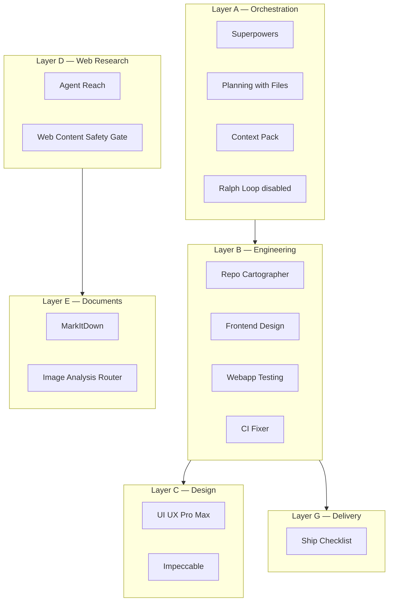

# Architecture — Cursor OS (netlify-demo)

## Project application

Static marketing/demo site deployed via **Netlify** with optional **Netlify Functions** (`@netlify/functions`, `netlify-cli`).

```
netlify-demo/
├── index.html, thank-you.html    # static pages
├── netlify.toml                  # deploy config
├── netlify/functions/            # serverless (if present)
├── package.json                  # netlify dev/deploy scripts
└── .cursor/                      # agent tooling (not deployed)
```

## Agent tooling architecture (seven layers)



## Scope boundaries

| Concern | Project repo | User global |
|---------|--------------|-------------|
| Skills | `.cursor/skills/` | `~/.cursor/skills/` |
| Hooks | `.cursor/hooks.json` | — |
| MCP | `.cursor/mcp.json` (future) | `~/.cursor/mcp.json` |
| Secrets | never committed | env / keychain |

## Routing entrypoints

- Project: `.cursor/skills/SKILL_ROUTING.md`
- OS: `docs/cursor-operating-system/06_SKILL_ROUTING.md`
