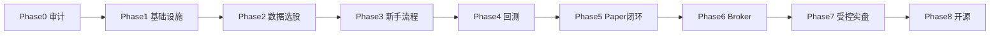

# 分阶段迁移计划（QuantOS CN 革命性重构）

> 基于 `A股新手智能投资平台_革命性重构_CURSOR_SPEC.md` V1.0  
> 原则：小闭环、可验证、不删失败测试、不用 Mock 冒充正式数据

---

## Phase 0：审计和冻结 ✅ 本轮完成

**交付物**
- [x] 真实架构识别（模块化单体 FastAPI + DuckDB + 文件存储）
- [x] `docs/audit/FUNCTION_REALITY_MATRIX.md`
- [x] Paper / 票据根因定位
- [x] Mock/fixture/空白功能清单
- [x] 本迁移计划

**冻结决策**
- 暂不暴露「实时选股」为正式功能（provider 未配置）
- 暂不连接生产券商资金

---

## Phase 1：修复基础设施 ✅ 完成

**验收标准**
- [x] README `make bootstrap && make app` 可启动
- [x] `/health` 含 data_gate_verdict
- [x] admin paper/start → PAPER_TRADING_ACTIVE
- [x] viewer paper/start → 结构化 PAPER_ENGINE_START_FAILED
- [x] 票据 EOD 可生成或返回 user_action
- [x] gateway-tests + phase1 tests PASS

---

## Phase 2：实时数据与选股 ✅ 完成

- [x] MarketDataGateway（`gateway/market_data_gateway.py`）
- [x] REALTIME/DELAYED/EOD 标签 API
- [x] 多样性约束（`quant/screener/diversity.py`）
- [ ] live provider 用户配置（需 Token，非代码阻塞）

---

## Phase 3：新手流程 ✅ 完成

- [x] 五步向导 UI + API
- [x] 风险画像服务端持久化
- [x] 新手报告 API

---

## Phase 4：研究与回测 ✅ 基础完成

- [x] DSR / PBO / benchmarks
- [ ] 完整 Purged K-Fold 生产集成（Phase 4+）

---

## Phase 5：Paper 完整闭环 ✅ 基础完成

- [x] Paper Engine 状态机
- [x] 晋级门控
- [ ] 独立 worker 进程

---

## Phase 6：Broker Gateway ✅ Sandbox 完成

- [x] 统一 BrokerGateway + QMT/PTrade sandbox
- [ ] 真实券商 TCP 会话

---

## Phase 7：受控实盘 ✅ 门控完成

- [x] Level 0–2 门控、`LEGAL_REVIEW_REQUIRED`
- [x] **不启用** real_money

---

## Phase 8：GitHub 发布 ✅ 文档完成

- [x] CHANGELOG / 完成报告 / 测试证据
- [ ] 用户自行 push 到 GitHub（无密钥）

---

## 依赖关系

## 回滚策略

每个 Phase 独立分支/提交；Phase 1 回滚仅涉及 envelope + paper RBAC + 前端门控 + autopilot 提示，不影响 DuckDB 数据。
